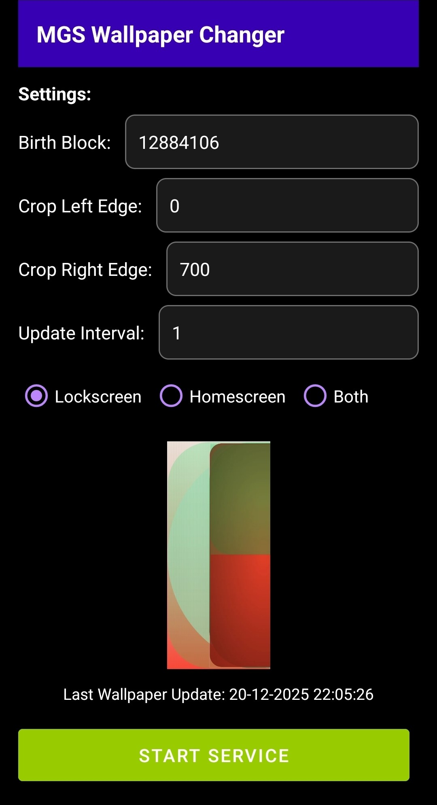

# Mutant Garden Seeder Wallpaper Changer Android

[Download APK](app/release/MGS-Wallpaper-Changer-V2.1.apk)

After installing the .apk, go to Settings -> Apps -> MGS Wallpaper Changer -> Remove permissions if app is unused: OFF and also set the battery usage permission to unrestricted. 
This is very important otherwise the system kills permissions before the next wallpaper update.

Open the app and adjust settings to your preferences (update interval takes decimals too).
Click "Start Service" to start the wallpaper changing service.

The service continues running after power off and reboot, so you start it once and forget about it.

Have fun and enjoy your Mutant Garden Seeder!

made by tschoerv.eth - donations are welcome :)
